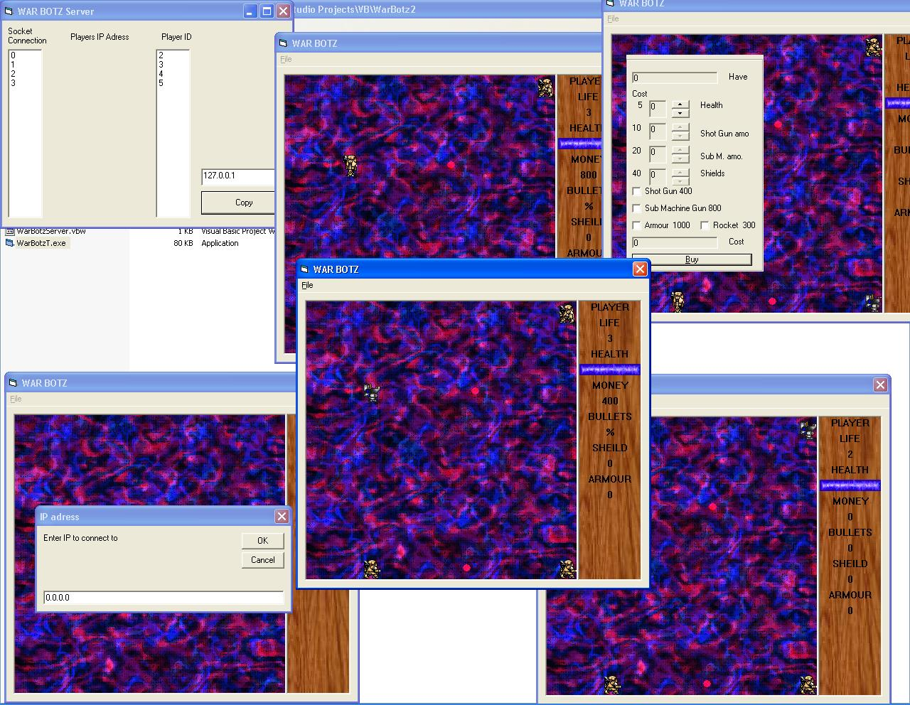

<div align="center">

## \_using winsock and win32 api to make a massive multi player online game


</div>

### Description

Ok so my game is probably not "massive" multi player but after looking for examples of online games on psc i found there were none that support more than 2 people having the server and the client play each other. In my WarBotz game the players connect to one server that only maintains and sends information and is not involved in the game (just like a real server). As long as there are ports to connect to there can be as many players (server probably will not be able to handle so many). To game its self uses a lot of win32 api including bitblt to make the game run faster/nicer. The code is fully commented i hope you enjoy my game and if u like it or not please vote something and/or leave comments I want to know how i could improve on it or what people think of it thanks =)
 
### More Info
 
WarBotz uses winsock controls to play online and the graphics are done using bitblt

watch refresh rate if you enable the change resolution part of the code


<span>             |<span>
---                |---
**Submitted On**   |2002-08-07 23:16:36
**By**             |[Olav Jordan](https://github.com/Planet-Source-Code/PSCIndex/blob/master/ByAuthor/olav-jordan.md)
**Level**          |Intermediate
**User Rating**    |4.7 (56 globes from 12 users)
**Compatibility**  |VB 6\.0
**Category**       |[Games](https://github.com/Planet-Source-Code/PSCIndex/blob/master/ByCategory/games__1-38.md)
**World**          |[Visual Basic](https://github.com/Planet-Source-Code/PSCIndex/blob/master/ByWorld/visual-basic.md)
**Archive File**   |[\_using\_win115523872002\.zip](https://github.com/Planet-Source-Code/olav-jordan-using-winsock-and-win32-api-to-make-a-massive-multi-player-online-game__1-37715/archive/master.zip)

### API Declarations

```
SetRect Lib "user32" (lpRect As RECT, ByVal X1 As Long, ByVal Y1 As Long, ByVal X2 As Long, ByVal Y2 As Long) As Long
OffsetRect Lib "user32" (lpRect As RECT, ByVal X As Long, ByVal Y As Long) As Long
CopyRect Lib "user32" (lpDestRect As RECT, lpSourceRect As RECT) As Long
IsRectEmpty Lib "user32" (lpRect As RECT) As Long
IntersectRect Lib "user32" (lpDestRect As RECT, lpSrc1Rect As RECT, lpSrc2Rect As RECT) As Long
CreateCompatibleDC Lib "gdi32" (ByVal hdc As Long) As Long
CreateCompatibleBitmap Lib "gdi32" (ByVal hdc As Long, ByVal nWidth As Long, ByVal nHeight As Long) As Long
BitBlt Lib "gdi32" (ByVal hDestDC As Long, ByVal X As Long, ByVal Y As Long, ByVal nWidth As Long, ByVal nHeight As Long, ByVal hSrcDC As Long, ByVal xSrc As Long, ByVal ySrc As Long, ByVal dwRop As Long) As Long
StretchBlt Lib "gdi32" (ByVal hdc As Long, ByVal X As Long, ByVal Y As Long, ByVal nWidth As Long, ByVal nHeight As Long, ByVal hSrcDC As Long, ByVal xSrc As Long, ByVal ySrc As Long, ByVal nSrcWidth As Long, ByVal nSrcHeight As Long, ByVal dwRop As Long) As Long
SelectObject Lib "gdi32" (ByVal hdc As Long, ByVal hObject As Long) As Long
GetObject Lib "gdi32" Alias "GetObjectA" (ByVal hObject As Long, ByVal nCount As Long, lpObject As Any) As Long
LoadImage Lib "user32" Alias "LoadImageA" (ByVal hInst As Long, ByVal lpsz As String, ByVal un1 As Long, ByVal n1 As Long, ByVal n2 As Long, ByVal un2 As Long) As Long
DeleteDC Lib "gdi32" (ByVal hdc As Long) As Long
DeleteObject Lib "gdi32" (ByVal hObject As Long) As Long
GetDeviceCaps Lib "gdi32" (ByVal hdc As Long, ByVal nIndex As Long) As Long
CreateDC Lib "gdi32" Alias "CreateDCA" (ByVal lpDriverName As String, ByVal lpDeviceName As String, ByVal lpOutput As String, lpInitData As Any) As Long
ChangeDisplaySettings Lib "user32" Alias "ChangeDisplaySettingsA" (lpDevMode As Any, ByVal dwFlags As Long) As Long
EnumDisplaySettings Lib "user32" Alias "EnumDisplaySettingsA" (ByVal lpszDeviceName As Long, ByVal iModeNum As Long, lpDevMode As Any) As Boolean
DrawText Lib "user32" Alias "DrawTextA" (ByVal hdc As Long, ByVal lpStr As String, ByVal nCount As Long, lpRect As RECT, ByVal wFormat As Long) As Long
SetBkMode Lib "gdi32" (ByVal hdc As Long, ByVal nBkMode As Long) As Long
sndPlaySound Lib "winmm.dll" Alias "sndPlaySoundA" (ByVal lpszSoundName As String, ByVal uFlags As Long) As Long
GetTickCount Lib "kernel32" () As Long
GetKeyState Lib "user32" (ByVal nVirtKey As Long) As Integer
GetQueueStatus Lib "user32" (ByVal fuFlags As Long) As Long
```


